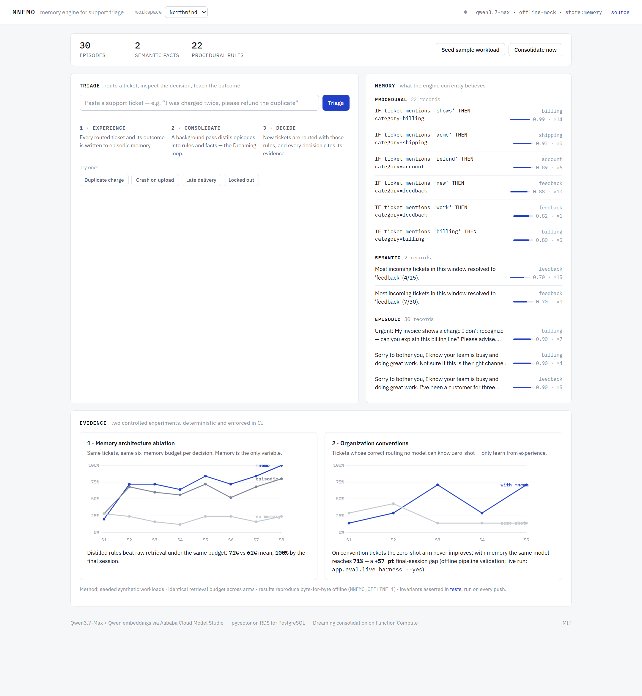
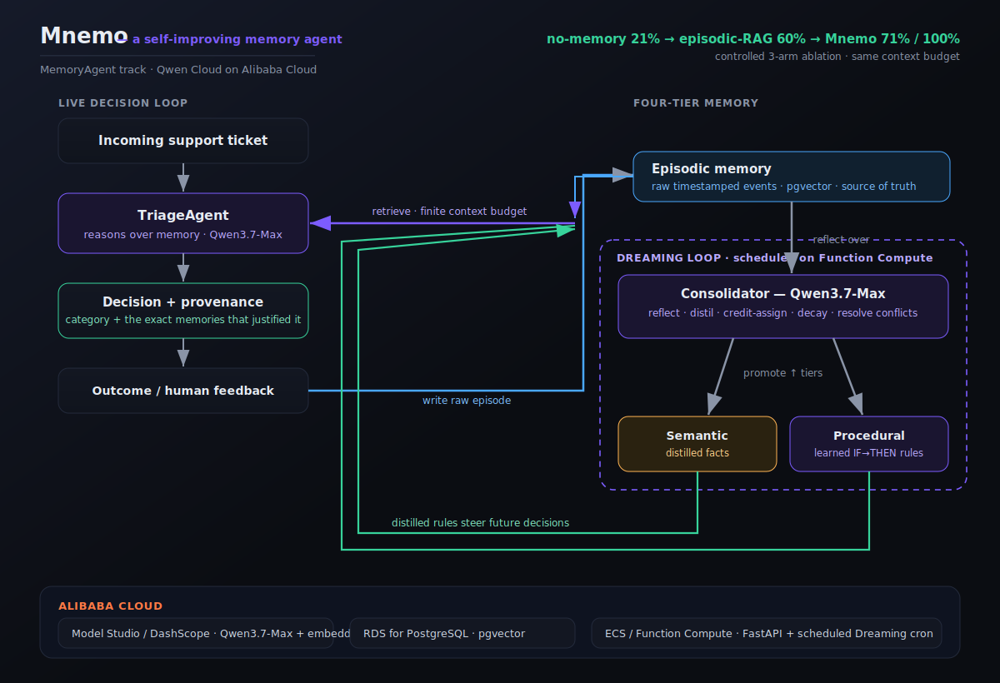

# Mnemo — a self-improving memory agent

> **Global AI Hackathon with Qwen Cloud — Track: MemoryAgent**
> An agent with a human-like, four-tier memory that autonomously accumulates
> experience and makes **measurably** more accurate decisions across sessions.

<p align="center"></p>

Most "memory agents" are a chatbot bolted to a vector database. Mnemo is a
**cognitive memory architecture**: raw experience flows in as episodes, and an
autonomous *Dreaming* loop — powered by **Qwen3.7-Max** — reflects on that
experience and distils it into durable **semantic facts** and **procedural rules**
that steer future decisions. We don't just claim it learns; we **prove it** with a
controlled three-arm experiment.

**Live console:** http://47.84.232.162:8000 — running on Alibaba Cloud ECS
(Singapore), real Qwen3.7-Max. *(Up for the judging window.)*

---

## The result (this is the whole point)

Support-ticket triage, 8 sessions × 25 tickets, identical tickets and identical
per-decision context budget across all three arms:

```
session:      1    2    3    4    5    6    7    8
no-memory     28   24   16   12   24   24   16   24   mean  21%   (≈ chance for 5 classes)
episodic      28   68   60   56   72   52   68   80   mean  60%   (raw-RAG baseline)
MNEMO         20   72   72   64   84   72   84  100   mean  71%   (episodic + Dreaming)
```

- **No-memory** never learns — flat at chance.
- **Episodic RAG** (retrieve past tickets) helps, but noisy raw context caps it.
- **Mnemo** distils experience into high-signal rules and, under the
  **same finite context budget**, converges faster and higher (**+10.5 pts mean**,
  **100% by session 8**).
- **Token economics:** Mnemo wins while consuming a **50% smaller memory context**
  per decision (574 vs 1155 chars) — signal per token, the practical answer to
  context rot. Test-enforced like everything else.

And two properties most memory agents can't demonstrate:

- **It unlearns.** When an org *changes* a policy, recency-weighted consolidation
  supersedes the stale rule within a few corrections instead of letting history
  outvote the present forever (`tests/test_adaptation.py`).
- **Workspaces are real memories, not filters.** Seed two orgs with different
  conventions and the *same ticket* routes differently in each — each decision
  citing that org's own learned policy (`tests/test_api.py`).

Reproduce it in ~2 seconds, no API key required:

```bash
# macOS / Linux
cd backend && pip install -r requirements.txt
MNEMO_OFFLINE=1 python -m app.eval.harness
```
```powershell
# Windows (PowerShell)
cd backend; pip install -r requirements.txt
$env:MNEMO_OFFLINE=1; python -m app.eval.harness
```

> Offline mode uses a deterministic heuristic + hashing embeddings so the pipeline
> and experiment run anywhere. With `DASHSCOPE_API_KEY` set, the exact same code
> path runs **Qwen3.7-Max** for reasoning and **Qwen embeddings** for retrieval.

---

## Experiment 2 — does memory help *Qwen itself*?

The fair challenge to any memory agent: *"wouldn't a frontier model ace this
zero-shot, no memory needed?"* On generic tickets — yes. So Experiment 2 uses tickets
whose ground truth depends on **organization conventions no model can know a priori**:

| Signal in ticket | Surface reading | Northwind's actual routing |
|---|---|---|
| "Project Falcon" | billing / account / shipping | **technical** (white-glove team owns all Falcon tickets) |
| refund request | billing | **account** (policy: refunds via account managers) |
| Acme + sync issue | technical | **shipping** (known shipping-feed bug) |
| beta-build report | technical | **feedback** (beta reports → product team) |
| purchase-order question | shipping | **billing** (the PO desk) |

Two arms, same tickets: **Qwen3.7-Max zero-shot** vs **Qwen3.7-Max + Mnemo memory**
(Dreaming consolidation between sessions). Zero-shot stays wrong on conventions
forever — however smart the model, it can't know your org. The memory arm learns them
from feedback:

```bash
python -m app.eval.live_harness          # free offline pipeline test
python -m app.eval.live_harness --yes    # live Qwen3.7-Max run (~160 calls), results
                                         # checkpointed to results/org_experiment.json
```

**Live result — real Qwen3.7-Max, both arms** (every prediction logged in
[`backend/results/org_experiment.json`](backend/results/org_experiment.json)):

```
convention tickets:        S1   S2   S3   S4   S5
qwen-alone (zero-shot)      0    0    0    0   14   mean  3%
qwen+mnemo                 14   71   86  100  100   mean 74%    final gap: +86 pts

plain tickets: zero-shot 98% · with mnemo 95%
```

Zero-shot Qwen3.7-Max scores **98% on ordinary tickets** — it is a superb model — and
**0% on org conventions** for four straight sessions, because no amount of model
quality can know Northwind's policies. With Mnemo, the *same model* reaches **100% by
session 4**. The Dreaming loop's distilled rules are readable, with rationales it
wrote itself:

> `IF text mentions 'Project Falcon' THEN category=technical (Project Falcon hardware,
> workspaces, and add-ons are technical)`
> `IF text mentions requesting or processing a refund THEN category=account (refund
> requests are handled under account management)`

The deterministic offline pipeline (same code path, mock client) reproduces the shape
for free in CI — `tests/test_org_learning.py` asserts all five conventions distill
correctly on every push.

> **The claim, precisely:** frontier models can't know your organization.
> Mnemo makes Qwen3.7-Max learn it — measurably.

---

## Architecture

<p align="center"></p>

**Four tiers (modelled on human memory):**

| Tier | Holds | Written by | Read for |
|------|-------|-----------|----------|
| **Working** | current session scratchpad | the live turn | in-context reasoning |
| **Episodic** | raw timestamped events | every decision + outcome | grounding, source of truth |
| **Semantic** | distilled facts & preferences | Dreaming loop | fast high-signal context |
| **Procedural** | learned `IF signal THEN action` rules | Dreaming loop | steering decisions |

**Retrieval** blends tiers and re-ranks by
`0.6·similarity + 0.15·recency(decay) + 0.15·importance + 0.10·confidence`, so
memories decay if unused and strengthen when they prove useful.

**Autonomy & maturity:** the Dreaming loop runs unattended — after each session on
the live server, or on a schedule via the bundled Function Compute handler
(`fc_dream.py`). It performs **credit assignment** (rules that drove correct calls gain
confidence, wrong ones lose it and eventually deactivate), **conflict resolution**
(a refined rule supersedes an outdated one instead of duplicating), and **decay**
(unused memories fade). Every decision is **explainable** — it cites the exact
memory ids that justified it.

---

## Qwen Cloud usage

- **Qwen3.7-Max** via the DashScope **OpenAI-compatible** endpoint for triage
  reasoning (function-calling ready) and for the reflection/consolidation step,
  using `preserve_thinking` to keep reasoning context coherent across turns.
- **Qwen embeddings** (`text-embedding-v4`) for the episodic vector index.
- Deployed on **Alibaba Cloud**: live on ECS (Singapore) —
  **http://47.84.232.162:8000** — with a pgvector-on-RDS store backend and a
  Function Compute handler (`fc_dream.py`) for scheduled Dreaming in production.

See [`docs/DEPLOY.md`](docs/DEPLOY.md) for the Alibaba Cloud deployment.

---

## Repo layout

```
backend/
  app/
    qwen_client.py        Qwen/DashScope wrapper (+ deterministic offline mock)
    memory/
      types.py            tiered memory data model
      store.py            InMemoryStore + pgvector PostgresStore
      manager.py          retrieval, decay, provenance, promotion
      consolidation.py    the Dreaming loop (online Qwen + offline distiller)
    agent/triage.py       the triage agent that thinks with memory
    eval/                 datasets + Experiment 1 (3-arm ablation) + Experiment 2
                          (org conventions: qwen-alone vs qwen+mnemo, live harness)
    api.py                FastAPI surface (deployable)
    static/index.html     dashboard: live tiers + 3-arm accuracy chart (served by API)
  tests/test_learning.py  regression test: memory improves accuracy
docs/DEPLOY.md            Alibaba Cloud deployment guide
```

## Run the API locally

```bash
cd backend && pip install -r requirements.txt
cp .env.example .env      # add DASHSCOPE_API_KEY for live Qwen, or leave offline
uvicorn app.api:app --reload
# open http://localhost:8000  → the dashboard (accuracy chart, live triage, memory tiers)
```

## License

MIT — see [LICENSE](LICENSE).
